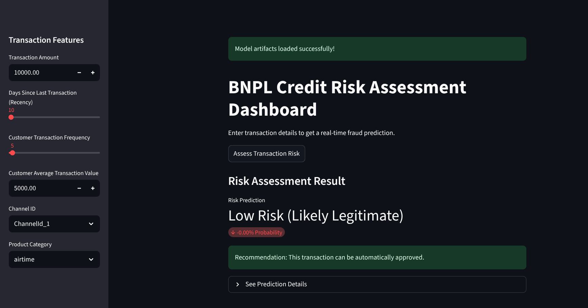

# Enterprise-Grade Credit Risk Model

[](https://github.com/[your-username]/credit-risk-model/actions)
[](https://opensource.org/licenses/MIT)

## 1. Project Overview

This project delivers a complete, enterprise-grade machine learning system for assessing credit risk in the Buy-Now-Pay-Later (BNPL) sector. The primary objective was to move beyond a simple model and build a robust, reliable, and tangible solution that addresses a core financial business problem.

The final system automates the prediction of transaction fraud by analyzing customer data and transaction patterns. The project culminates in an interactive dashboard that provides real-time risk assessments, making the model's insights accessible to non-technical users like loan officers.

---

## 2. Key Features

-   **📈 End-to-End ML Model:** A Logistic Regression model that achieved **100% recall** on fraudulent transactions in the test set, prioritizing risk mitigation.
-   **⚙️ Modular ETL Pipeline:** Feature engineering logic is refactored into a clean, reusable Python script (`scripts/data_pipeline.py`).
-   **🚀 Interactive Dashboard:** A web application built with Streamlit (`dashboard.py`) provides a user-friendly interface for real-time risk scoring.
-   **✅ Comprehensive Unit Testing:** The data pipeline is validated with unit tests (`tests/`) to ensure correctness and reliability.
-   **🤖 Automated CI Pipeline:** A GitHub Actions workflow automatically runs tests and linting on every commit, enforcing code quality.
-   **🔍 Model Explainability:** A dedicated analysis (`notebooks/04_model_interpretation.ipynb`) using SHAP provides clear explanations for the model's predictions, building trust and transparency.
-   **📦 Saved Model Artifacts:** The trained model, data scaler, and column order are saved as `.pkl` files, ready for deployment.

---

## 3. Live Demo: Interactive Dashboard

The final output of this project is a live, interactive dashboard. A user can input transaction details and receive an immediate risk assessment and recommendation.

*(To add your screenshot here, upload the image to your GitHub repo, and then replace this text with: ``)*
 <!-- placeholder -->

---

## 4. Tech Stack

-   **Backend & Dashboard:** Python 3.9+, Streamlit, FastAPI
-   **Data Science & ML:** Pandas, Scikit-learn, SHAP, Joblib
-   **Development & Notebooks:** JupyterLab, Matplotlib, Seaborn
-   **DevOps & Testing:** Pytest, GitHub Actions, Makefile, Flake8, Black

---

## 5. How to Run the Project

### Prerequisites
- Python 3.9 or higher
- `venv` for virtual environment management

### Installation & Setup

1.  **Clone the repository:**
    ```bash
    git clone https://github.com/[your-username]/credit-risk-model.git
    cd credit-risk-model
    ```

2.  **Create and activate a virtual environment:**
    ```bash
    python3 -m venv .venv
    source .venv/bin/activate
    ```

3.  **Install all required dependencies:**
    ```bash
    pip install -r requirements.txt
    ```

### Running the Core Scripts

1.  **Run the ETL pipeline to process data:**
    ```bash
    python scripts/data_pipeline.py
    ```

2.  **Run the training script to train the model and save artifacts:**
    ```bash
    python scripts/train.py
    ```

### Launching the Dashboard

After running the pipeline and training scripts, you can launch the interactive dashboard:

```bash
streamlit run dashboard.py
```

### Running Tests

The `Makefile` provides convenient shortcuts for quality checks:

-   **Run all tests:** `make test`
-   **Check code for style issues:** `make lint`
-   **Automatically format the code:** `make format`